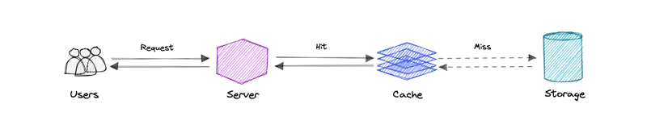
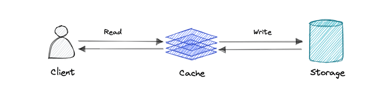
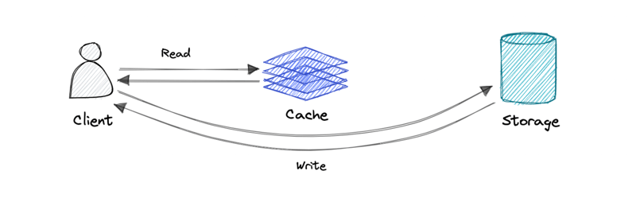
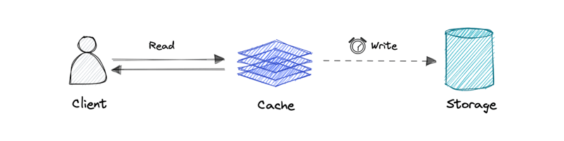
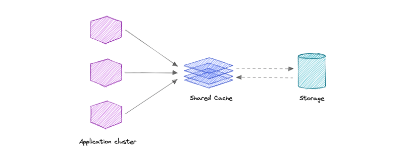
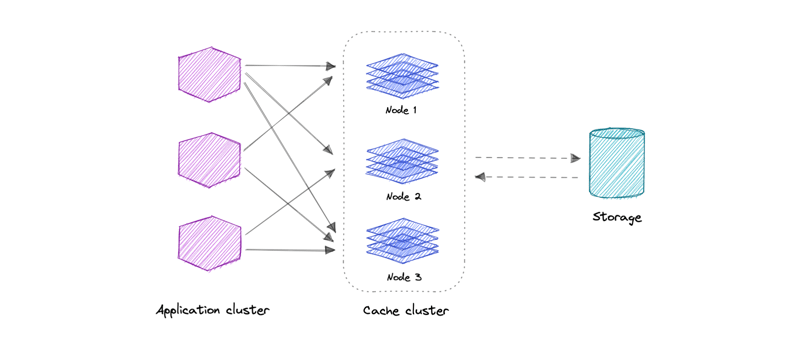

- [Caching](#caching)
- [Cache Hit and Cache Miss](#cache-hit-and-cache-miss)
  - [Cache Hit](#cache-hit)
  - [Cache Miss](#cache-miss)
- [Cache Invalidation](#cache-invalidation)
  - [Write-Through Cache](#write-through-cache)
  - [Write-Around Cache](#write-around-cache)
  - [Write-Back Cache](#write-back-cache)
- [Cache Eviction](#cache-eviction)
  - [Eviction Policies](#eviction-policies)
- [When Not to Use Caching](#when-not-to-use-caching)
- [Advantages of Caching](#advantages-of-caching)
- [Caches in Different Layers](#caches-in-different-layers)
- [Global Cache](#global-cache)
- [Distributed Cache](#distributed-cache)
- _Refs_: [Link 1](https://medium.com/must-know-computer-science/system-design-caching-acbd1b02ca01), [Link 2](https://dev.to/karanpratapsingh/system-design-caching-18j4)

# Caching

- A cache's primary purpose is to **increase data retrieval performance** by reducing the need to access the underlying slower storage layer.
- Trading off capacity for speed, a cache typically stores a subset of data transiently, in contrast to databases whose data is usually complete and durable.

# Cache Hit and Cache Miss

## Cache Hit

- A cache hit occurs when requested content is found in the cache.
- Process
  1. Tags, which are keys linked to cached data, are quickly searched in memory for fast retrieval.
  1. Data is retrieved and served from the cache.
- Results in faster response times and reduced load on the primary data source.

## Cache Miss

- A cache miss occurs when the requested content is not found in the cache.
- Process
  1. Memory is searched for the data
  1. If not found, content is fetched from the primary data source.
  1. Retrieved data is then written into the cache.
- Leads to slower response times and increased load on the primary data source.

# Cache Invalidation

- Cache Invalidation is the process of marking cache entries as invalid and removing or replacing them.
- Necessary when data is modified to prevent serving stale or incorrect data.
- 3 types of cache invalidation strategies: (i) Write-Through Cache, (ii) Write-Around Cache, (iii) Write-Back Cache

## Write-Through Cache

- Data is written into the cache and the corresponding database simultaneously.
- **Pro**: Fast retrieval, complete data consistency between cache and storage.
- **Con**: Higher latency for write operations.

## Write-Around Cache

- Write operation directly goes to the database or permanent storage, bypassing the cache.
- **Pro**: May reduce latency
- **Con**: It increases cache misses because the cache system has to read the information from the database in case of a cache miss. As a result, this can lead to higher read latency in the case of applications that write and re-read the information quickly. Read happen from slower back-end storage and experiences higher latency.

## Write-Back Cache

- Write operation is only done to the caching layer and the write is confirmed as soon as the write to the cache completes. The cache then **asynchronously** syncs this write to the database.
- **Pro**: This would lead to reduced latency and high throughput for write-intensive applications.
- **Con**: There is a risk of data loss in case the caching layer crashes. We can improve this by having more than one replica acknowledging the write in the cache.

# Cache Eviction

- The process of removing items from a cache to free up space for new data.

## Eviction Policies

- **First In First Out (FIFO)**:
  - Evicts the oldest cache entry first, regardless of access frequency.
- **Last In First Out (LIFO)**:
  - Evicts the most recently added item first, ignoring access history.
- **Least Recently Used (LRU)**:
  - Discards items that have not been used for the longest time.
- **Most Recently Used (MRU)**:
  - Discards items that were used most recently, opposite of LRU.
- **Least Frequently Used(LFU)**:
  - Counts how often an item is used. Those that are used least often are discarded first.
- **Random Replacement (RR)**:
  - Randomly selects a candidate item and discards it to make space when necessary.

# When Not to Use Caching?

- **Equal Access Time**: Caching is ineffective if accessing the cache takes as long as accessing the primary data store.
- **Low Request Repetition**: Caching is less beneficial for requests with low repetition or high randomness because caching performance comes from repeated memory access patterns.
- **Frequent Data Changes**: Caching can lead to outdated data if the underlying data changes frequently, requiring constant access to the primary data store.
- **Transient Nature**: Caches should not be used for permanent data storage, as they are typically implemented in volatile memory and are meant to be temporary.

# Advantages of Caching

- **Reduces Latency**: Lowers the time taken to access data, resulting in quicker response times.
- **Decreases Load on the Database**: Minimizes the number of requests to the primary data store, alleviating pressure on resources.
- **Lowers Network Costs**: Reduces the amount of data transmitted over the network, saving bandwidth and costs. Don't need to keep establishing TCP connections with the database.
- **Increases Read Throughput**: Enhances the system's ability to handle more read requests simultaneously.

# Caches in Different Layers

## Client-Side

- Use Case: Accelerate retrieval of web content from websites (browser or device)
- Tech: HTTP Cache Headers, Browsers
- Solutions: Browser Specific
- Example: Browsers cache static assets (like images and CSS files) in local storage (e.g., memory or disk cache), reducing load times on subsequent visits.

## DNS

- Use Case: Domain to IP resolution
- Tech: DNS Servers
- Solutions: Amazon Route 53
- Example: When a user visits a website, their device caches the DNS response in the local DNS resolver or operating system cache, allowing faster access for subsequent requests without querying the DNS server again.

## Web Server

- Use Case: Accelerate web content retrieval and manage server-side sessions
- Tech: HTTP Cache Headers, CDNs, Reverse Proxies, Web Accelerators, Key/Value Stores
- Solutions: Amazon CloudFront, ElastiCache for Redis, ElastiCache for Memcached, Partner Solutions
- Example: A web application uses Amazon CloudFront to cache frequently accessed content at edge locations, minimizing latency for users across different geographic regions, while session data may be cached in Redis or Memcached on the server side.

## Application

- Use Case: Accelerate application performance and data access
- Tech: Key/Value data stores, Local caches
- Solutions: Redis, Memcached
- Example: Caches are kept directly on the application server. When a request is made, the server checks the local cache first; if the data is not found, it queries the database.
- Challenges with Multiple Nodes:
  1. **Load Balancer**: Randomly distributes requests, potentially leading to uneven cache usage.
  1. **Cache Misses**: The same request may reach different nodes, increasing the likelihood of cache misses.
  1. **Redundant Storage**: Same data may be stored across multiple nodes, leading to extra storage use.
- Solutions for Issues:
  1. **Global Caches**: Use a centralized cache that all nodes can access to reduce redundancy and cache misses.
  1. **Distributed Caches**: Implement caching solutions that synchronize data across nodes, ensuring consistency and reducing redundant storage.

## Database

- Use Case: Reduce latency associated with database query requests
- Tech: Database buffers, Key/Value data stores
- Solutions:
  - Default Caching: Databases typically include built-in caching mechanisms optimized for generic use cases.
  - Optimization: Tweaking cache settings based on specific usage patterns can further enhance performance.
  - External Caching: Use Redis or Memcached for additional caching layers to improve query response times.
- Example: A relational database like MySQL uses query caching to store the results of frequent queries, allowing repeated requests to return results quickly without re-executing the query.

## Content Distribution Network (CDN)

- Use Case: Offload serving static media from application servers and provide geographic distribution.
- Solutions: Amazon CloudFront, Akamai
- For Smaller Systems, if a CDN is not feasible for smaller systems, consider the following approach:
  1. **Separate Subdomain**: Serve static media from a different subdomain using a lightweight HTTP server (e.g., Nginx, Apache).
  1. **DNS Cutover**: Transition the DNS from this subdomain to a CDN layer when scaling or demand increases.
- Example: A website uses Amazon CloudFront to cache and deliver images and videos from edge locations, ensuring faster access for users worldwide, while initially serving these assets from a dedicated subdomain on a local server.

## Other Cache

- **CPU Cache**
  - Description: Small memory located on or near the CPU that operates faster than main memory.
  - Details: Most CPUs since the 1980s utilize multiple caches, often in cascaded levels. High-end processors may feature up to 6 types of cache.
  - Example: L1, L2 and L3 caches that store frequently accessed data and instructions to speed up processing.
- **GPU Cache**
  - Description: Caches specific to graphics processing units that help speed up rendering and processing of graphics.
  - Example: NVIDIA and AMD GPUs include dedicated caches for textures and computation data to enhance performance in graphical applications.
- **Disk Cache**
  - Description: A cache that stores frequently accessed data from disk to reduce read times.
  - Details: Unlike CPU caches, disk caches are often managed by software, typically the operating system kernel.
  - Example: The page cache in main memory that keeps copies of frequently accessed disk pages to minimize disk I/O operations.

# Global Cache

- A single shared cache used by all application nodes.
- On cache miss, it retrieves data from the underlying data store.
- All nodes query the same cache space (server or file store).
- Scalability Concern: High client and request volume can overwhelm a single cache.
- Cache Miss Handling:
  - Request Nodes
    - Aims to keep a large portion of frequently accessed data (hot data) in the cache.
    - Stores static files that are not meant to be removed from the cache.
    - Uses application-specific logic to optimize how data is evicted and to identify frequently accessed data (hot spots).
- Advantages:
  - Easier to implement and manage since there's a single cache space.
  - Ensures uniformity across all application nodes, as they access the same cached data.
  - Quick access to frequently used data from a centralized location
- Disadvantages:
  - Can become a bottleneck as the number of clients or requests increases, leading to performance issues.
  - If the global cache fails, all application nodes lose access to cached data.
  - Increased load on the cache server may result in slower response times during peak usage.

# Distributed Cache

- Cache data is divided using a consistent hashing function, with each node responsible for a portion of the cache.
- Requesting nodes can quickly locate data by applying the hashing function within the distributed cache.
- Scalability: Easily expand cache capacity by adding more nodes to the system.
- Resilience: If one of the nodes in a distributed cache goes down, it can cause some of the cached data to be lost; mitigating this risk involves storing multiple copies of data across different nodes.
- Architecture: Allows multiple networked computers to work together, pooling their RAM to create a larger, unified in-memory cache. This means increased capacity - the total memory available for caching is greater than what a single computer can provide, as it uses the combined RAM of all participating machines.
- Advantages:
  - Easily scales by adding more nodes, which increases cache capacity and distributes the load.
  - Redundant data storage across nodes reduces the risk of data loss if one node fails.
  - Can enhance access speed as requests are served by multiple nodes simultaneously.
- Disadvantages:
  - More complex to implement and manage due to distributed architecture and data consistency challenges.
  - Ensuring data consistency across nodes can be challenging, especially during updates.
  - Increased memory usage due to data replication for redundancy.
