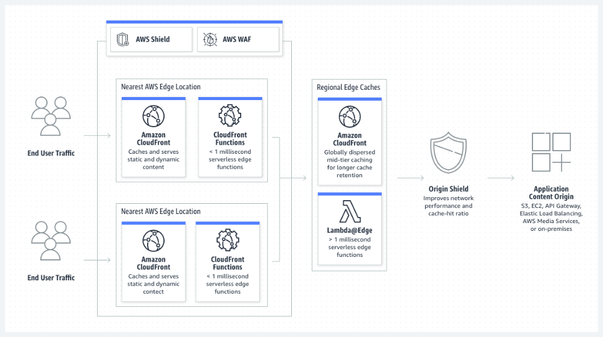

- [Content Delivery Network (CDN)](#content-delivery-network-cdn)
- [Why is a CDN important?](#why-is-a-cdn-important)
- [Benefits of CDN](#benefits-of-cdn)
- [What Internet Content can a CDN deliver?](#what-internet-content-can-a-cdn-deliver)
- [How does a CDN work?](#how-does-a-cdn-work)
  - [Caching](#caching)
  - [Dynamic Acceleration](#dynamic-acceleration)
  - [Edge Logic Computations](#edge-logic-computations)
- [What is a CDN used for?](#what-is-a-cdn-used-for)
  - [High-Speed Content Delivery](#high-speed-content-delivery)
  - [Real-time Streaming](#real-time-streaming)
  - [Multi-User Scaling](#multi-user-scaling)
- [Amazon CloudFront](#amazon-cloudfront)
- _Refs_: [Link 1](https://aws.amazon.com/what-is/cdn/)

# Content Delivery Network (CDN)

- CDN consists of interconnected servers designed to enhance webpage loading speeds.
- Reduces latency by serving content from servers closer to the user.
- Optimizes loading times for data-heavy applications like videos and images.
- Mitigates the impact of distance from the origin server on content delivery.

# Why is a CDN important?

- Primary goal of a CDN is to reduce latency and communication delays.
- Addresses challenges posed by the global and complex nature of internet traffic.
- CDNs facilitate two-way communication by acting as intermediaries for client requests and server responses.
- Introduces intermediary servers to optimize client-server interactions.
- Reduces direct traffic to the origin server, lowering bandwidth consumption.
- Enhances overall user experience for web applications.

# Benefits of CDN

- **Reduce page load time**
  - Website traffic can decrease if your page load times are too slow.
  - A CDN can reduce bounce rates (users clicking away from your website) and increase the time users spend on your site.
- **Reduce bandwidth costs**
  - Bandwidth costs are a significant expense because every incoming website request consumes network bandwidth.
  - Through caching and other optimizations, CDNs can reduce the amount of data an origin server must provide, reducing the costs of hosting for website owners.
- **Increase content availability**
  - Too many visitors at one time or network hardware failures can cause a website to crash.
  - CDN servers can handle more web traffic and reduce the load on web servers.
  - If 1 or more CDN servers go offline, other operational servers can replace them to ensure uninterrupted service.
- **Improve website security**
  - DDoS attacks attempt to take down applications by sending large amounts of fake traffic to the website.
  - CDNs can handle such traffic spikes by distributing the load between several intermediary servers, reducing the impact on the origin server.

# What Internet Content can a CDN deliver?

- **Static Content**
  - Static content is website data that does not change from user to user.
  - Website header images, logos, and font styles remain the same across all users, and the business does not change them frequently.
  - Static data does not need to be modified, processed, or generated and is ideal for storage on a CDN
- **Dynamic Content**
  - Dynamic content such as social media news feeds, weather reports, login status, and chat messages vary among website users.
  - This data changes based on the user's location, login time, or user preferences, and the website must generate the data for every user and every user interaction.
  - **Cache-Control Headers**: Respect settings from the origin server to determine caching duration and retrieval requirements.
  - **Fragment Caching**: Cache only specific, less frequently changing parts of the response, like images, while dynamically fetching user-specific data.

# How does a CDN work?

- CDNs work by establishing a Point of Presence (POP) or a group of CDN edge servers at multiple geographical locations.
- An **edge server** is a server located close to the end user within a content delivery network (CDN).
- This geographically distributed network works on the principle of caching, dynamic acceleration and edge logic computations.

## Caching

- In CDN, caching refers to the process of storing static website content on multiple servers in the network.
- Caching in CDN works as follows:
  1. A geographically remote website visitor makes the first request for static web content from your site.
  1. The request reaches your origin server. The origin server sends the response to the remote visitor. At the same time, it also sends a copy of the response to the CDN POP geographically closest to that visitor.
  1. The CDN POP server stores the copy as a cached file.
  1. The next time this visitor, or any other visitor in that location, makes the same request, the caching server, not the origin server, sends the response

## Dynamic Acceleration

- Dynamic Acceleration reduces server response time for dynamic web content by utilizing CDN servers as intermediaries.
- **Challenge with Dynamic Content**: Caching is less effective because content may vary with each user request, necessitating reconnection to the origin server for each request.
- Benefits of CDN
  - Optimizes the connection process between CDN servers and origin servers.
  - Mitigates network latency and potential request loss/delays due to network latency without CDN.
- Connection Efficiency
  - CDN servers maintain ongoing, trusted connections with origin servers, reducing time spent on connection establishment and security verification.
- Optimization Features
  - **Intelligent Routing Algorithms**: Enhance the efficiency of request handling.
  - **Geographic Proximity**: Closer CDN servers reduce latency.
  - **Request Processing**: Ability to process and reduce the size of client requests for faster handling.

## Edge Logic Computations

- Edge servers in a CDN can perform logical computations to simplify communication between the client and server.
- For example, this server can do the following:
  - Inspect user requests and modify caching behavior.
  - Validate and handle incorrect user requests.
  - Modify or optimize content before responding.
- Distribution of application logic between the web servers and the network edge helps developers offload origin servers' compute requirements and improve website performance.

# What is a CDN used for?

## High-Speed Content Delivery

- CDNs enhance the delivery of both static and dynamic content, providing a high-performing, global experience for users.

---

- **Case Study**: Reuters, a leading news wholesaler, utilizes CDNs to meet the challenge of timely news delivery worldwide.
- Benefits for Media Companies:
  - Timeliness: Enables rapid dissemination of news content to global audience.
  - Reliability: Reduces dependence on less efficient communication methods (e.g., satellite links).
- Technology Integration
  - Amazon CloudFront: Used in conjunction with Amazon S3 for efficient content distribution.
  - Cost-Effectiveness: Provides a secure and highly available network at reduced costs.

---

## Real-time Streaming

- CDNs help reliably and cost-effectively deliver rich and high-quality media files.
- Companies streaming video and audio use CDNs to overcome 3 challenges: (i) reduce bandwidth costs, (ii) increase scale, (iii) decrease delivery time
- For example, Hulu is an online video streaming platform that uses Amazon CloudFront to consistently stream more than 20 GBps of data to its growing customer base.

## Multi-User scaling

- CDNs help support a large number of concurrent users.
- Website resources can manage only a limited number of client connections at a time.
- CDNs can reliably scale this number by taking some of the load from the application server.

---

- **Case Study**: King, a gaming company, servers over 350 million players and records 10.6 billion games daily.
- **Data Consistency**: Central data centers allow players to access game data across devices without losing progress.
- Performance Optimization: CDNs help provide a consistent experience, even for users on older machines with limited bandwidth.
- Content Delivery: King utilizes Amazon CloudFront to deliver vast amounts of content, with daily traffic reaching hundreds of terabytes and peaks at half a petabyte during game launches or marketing events.

---

# Amazon CloudFront

Amazon CloudFront is a content delivery network (CDN) service built for high performance, security and developer convenience. Can use Amazon CloudFront to do these tasks:

- Deliver data through 450\_ globally dispersed points of presence (POPs) with automated network mapping and intelligent routing.
- Improve security with traffic encryption and access controls, and use AWS Shield Standard to defend against distributed denial-of-service (DDoS) attacks at no additional charge.
- Customize the code you run at the AWS network edge using serverless compute features to balance cost, performance, and security.
- Scale automatically to deliver software, game patches, and IoT updates with high transfer rates.
