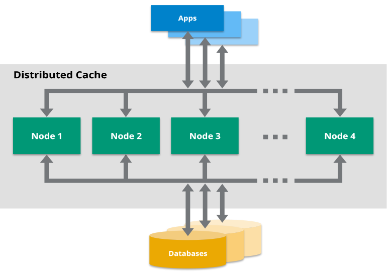

# Caching

- Caching is a technique for storing and retrieving frequently accessed data or computations to speed up subsequent requests, reducing time and resources needed to fetch data from the original source.
- Caching improves performance and reduces latency by temporarily storing data in a cache.
- Types of Caching: (i) Local Caching, (ii) Distributed Caching
- Local Caching
  - Involves storing data on a single machine or within a single application.
  - Best suited for scenarios with limited data retrieval needs or smaller data volumes.
  - E.g., browser caches and application-level caches.

# Distributed Cache

- A distributed cache is a caching system that spreads data across multiple nodes in a cluster and across various data centers worldwide.
- Pools the RAM of multiple networked computers into a single in-memory data store, allowing for fast data access.
- Overcomes the memory limits of a single server by linking multiple computers, enabling growth and increased processing power.
- Particularly beneficial in environments with high data volume and load.
- Improves application reliability and speed by storing frequently accessed data closer to users, reducing latency.
- Decreases strain on backend systems by minimizing the need for frequent data retrieval from slower storage solutions.

# Challenges with Local Caching in Distributed Systems

- **Data Inconsistencies**: Updates in one server's cache may not be reflected across others, leading to stale data for users.
- **Increased Latency**: Requests for data may experience delays if the needed data is not present in the local cache and must be fetched from a slower backend.
- **Bottlenecks**: Over-reliance on local caches can create performance issues if many servers are attempting to access or update the same resource.
- **Scalability Issues**: Local caches may not efficiently handle the increased load as applications grow and user locations diversify.
- **Complexity in Synchronization**: Maintaining consistency across multiple cache introduces complexity in ensuring all servers are updated simultaneously.

# Benefits of Distributed Cache

- 