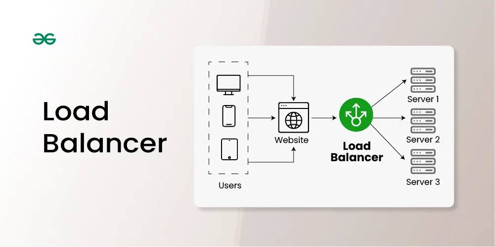
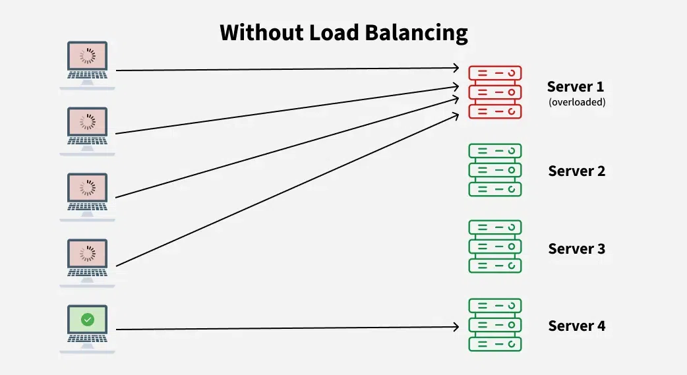
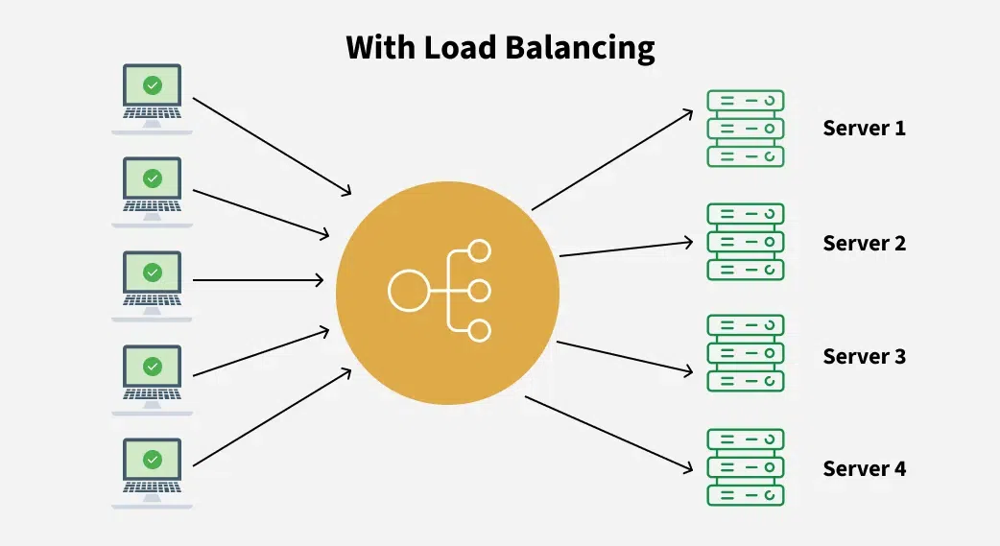
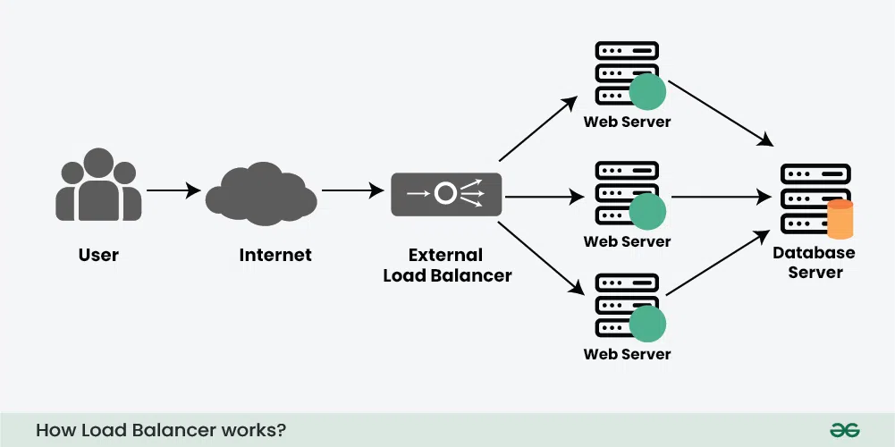

# Load Balancing

- Distributed incoming network traffic across multiple servers to prevent any single server from being overburdened.
- Purpose:
  - Enhances performance, reliability, and availability of applications
  - Ensures efficient utilization of server resources
- Functionality:
  - Acts as a "traffic cop" sitting in front of servers and routing client requests to servers in a balanced manner.
- Applications:
  - Widely used in cloud computing, data centers, and large-scale web applications.
- Key Benefit:
  - Ensures high availability and smooth operation of systems by evenly spreading request loads.

# Problems Without Load Balancing

- **Single Point of Failure**
  - If the single server fails, the entire application becomes unavailable, leading to service interruptions and a poor user experience.
- **Overloaded Servers**
  - Servers have a limit on the number of requests they can handle.
  - Increased traffic due to business growth can overload the server, causing degraded performance or downtime.
- **Limited Scalability**
  - Adding more servers to handle traffic becomes challenging without a load balancer, as all requests are still directed to a single server.
  - The absence of automatic traffic distribution prevents efficient utilization of additional resources.

# Key Characteristics of Load Balancers

- **Traffic Distribution**
  - Evenly distributes incoming requests across multiple servers to prevent overloading any single server.
- **High Availability**
  - Enhances reliability by rerouting traffic to healthy servers if one fails.
- **Scalability**
  - Simplifies horizontal scaling by enabling seamless addition of servers to handle increased traffic demands.
- **Optimization**
  - Ensures efficient resource utilization, preventing bottlenecks and maximizing server capacity.
- **Health Monitoring**
  - Continuously checks server health and redirects traffic away from servers with issues or downtime.
- **SSL Termination**
  - Offloads SSL/TLS encryption or decryption from servers, improving overall performance.

# How Load Balancer Works

1. **Receives Incoming Requests**
   - Acts as the first point of contact for user requests, intercepting them before reaching the servers.
2. **Checks Server Health**
   - Continuously monitors server status to determine which servers are healthy and capable of handling requests.
3. **Distributes Traffic**
   - Forwards requests to the most suitable server based on factors such as load, response time, or proximity
   - Ensures no single server becomes overloaded.
4. **Handles Server Failures**
   - Automatically redirects traffic away from unresponsive or failed servers to maintain service availability
5. **Optimizes Performance**
   - Efficiently spreads traffic across healthy servers, enhancing performance and reducing latency.

# Types of Load Balancers

1. **Hardware Load Balancers**
   - Physical devices deployed in data centers.
   - Reliable and specialized but expensive to purchase, scale and maintain.
   - Suitable for large enterprises with high and consistent traffic volumes.
2. **Software Load Balancers**
   - Software-based solutions that distribute traffic across servers.
   - Operate on existing infrastructure (on-premises or cloud).
   - More scalable and cost-effective than hardware load balancers.
   - Suitable for range of businesses, including cloud-based systems.
     > Choosing between software and hardware load balancers: Choose based on scale, budget and performance needs.
3. **Cloud Load Balancers**
   - Provided as a service by cloud providers (e.g., AWS, Google Cloud, Azure).
   - Automatically manage traffic distribution without requiring physical hardware.
   - Scalable and pay-as-you-go model.
   - Ideal for dynamic workloads and cloud-based applications.
4. **Layer 4 (Transport Layer) Load Balancers**
   - Operate at the OSI transport layer (TCP/UDP), using IP addresses and port numbers.
   - Do not inspect data, offer faster routing for basic traffic distribution.
   - Suitable for simpler, high-volume traffic management with low overhead.
5. **Layer 7 (Application Layer) Load Balancers**
   - Work at the OSI application layer and route traffic based on application data (e.g., HTTP headers, URLs, cookies).
   - Capable of complex routing decisions, like content-based distribution.
   - Commonly used for web applications that require specific routing for user preferences or content type.
6. **Global Server Load Balancers (GSLB)**
   - Distribute traffic across servers in multiple geographic regions.
   - Improve user experience by directing requests to the closes or most responsive server.
   - Enhance disaster recovery by maintaining service availability across regions or data centers.

# Benefits of Using a Load Balancer

- **Increases Performance**
  - Prevents downtime and ensures consistent performance, even with high traffic loads.
- **Increases Scalability**
  - Enables auto-scaling by provisioning more servers when traffic increases, maintaining balanced load distribution.
- **Efficiently Manages Failure**
  - Redirects traffic away from unhealthy or failing servers, ensuring continued service availability.
- **Prevents Traffic Bottleneck**
  - Anticipates traffic surges and helps prevent overload, ensuring smooth handling of high traffic.
- **Efficient Resource Utilization**
  - Distributes workloads evenly across multiple servers, optimizing resource use and preventing overloading.
- **Maintains User Sessions**
  - Configured for session persistence, ensuring stateful communication even when traffic is routed to different servers.

# Challenges of Using Load Balancers

- **Single Point of Failure**
  - If the load balancer itself fails, traffic distribution can be disrupted, creating a potential point of failure.
- **Complexity and Cost**
  - High-quality load balancing solutions can be expensive and difficult to implement and manage, whether they are software or hardware-based.
- **Configuration Challenges**
  - Properly configuring load balancers in complex architectures or diverse server environments can be challenging.
- **Potential for Overhead**
  - Load balancing techniques and configurations may introduce delays and additional processing time, though modern systems aim to minimize this.
- **SSL Inspection Challenges**
  - SSL termination at the load balancer can complicate SSL inspection and handling of end-to-end encryption.
