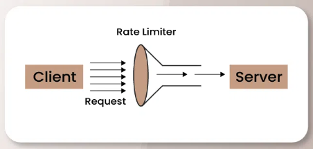
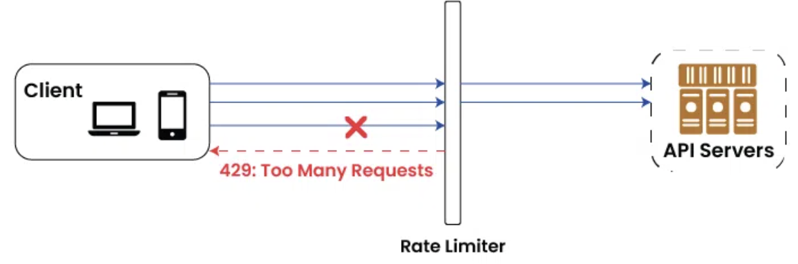
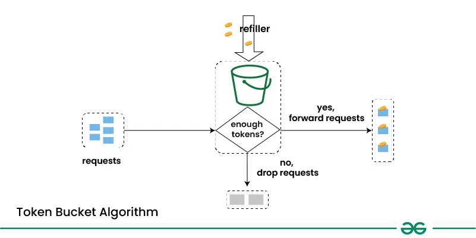
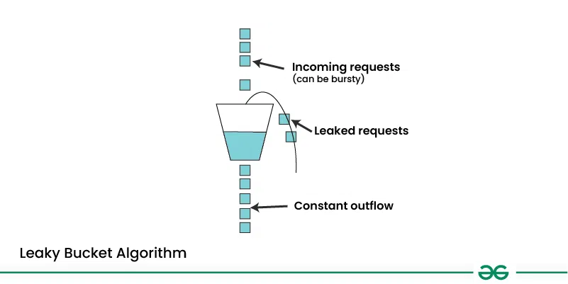
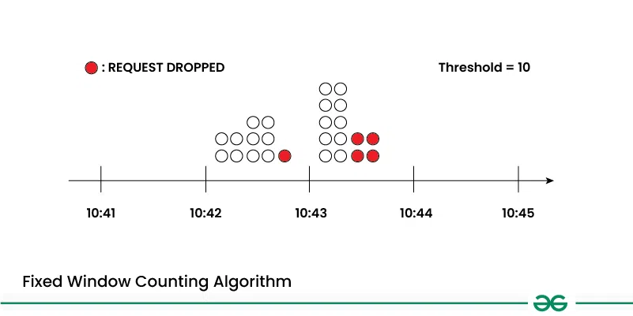
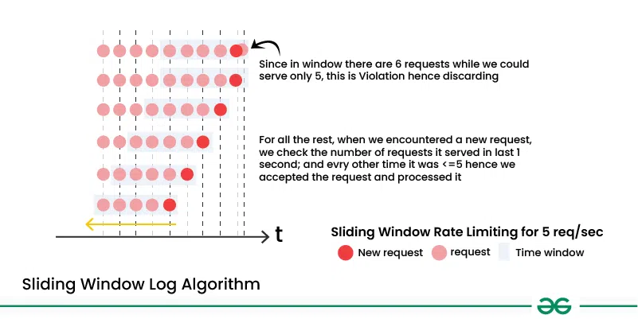

- [Rate Limiting](#rate-limiting)
- [Use Cases of Rate Limiting](#use-cases-of-rate-limiting)
- [Types of Rate Limiting](#types-of-rate-limiting)
- [How Rate Limiting works?](#how-rate-limiting-works)
- [Rate Limiting Algorithm](#rate-limiting-algorithm)
- [Client-Side vs Server-Side Rate Limiting](#client-side-vs-server-side-rate-limiting)
- [Rate Limiting in Different Layers of the System](#rate-limiting-in-different-layers-of-the-system)
- [Challenges of Rate Limiting](#challenges-of-rate-limiting)
- _Refs_: [Link 1](https://www.geeksforgeeks.org/rate-limiting-in-system-design/)

# Rate Limiting

- Rate limiting controls the flow of requests in a system by regulating the quantity or frequency of incoming requests, ensuring stability and reliability.
- Purpose:
  - Prevents system overload
  - Enhances security by mitigating risks like resource abuse and denial-of-service (DoS) attacks.
  - Ensures fair resource distribution among clients.
- Benefits:
  - Maintains system stability and performance
  - Protects against excessive traffic or malicious activity.
- Use Cases:
  - Applied in web servers, APIs, network traffic management, and database access to maintain optimal performance and security.

## What is a Rate Limiter?

- A rate limiter is a component that controls the rate of traffic or requests to a system. It is a specific implementation or tool used to enforce rate-limiting.

# Use Cases of Rate Limiting

- **API Rate Limiting**: APIs commonly employ rate limitation to control the volume of client requests, ensure fair access to resources, and prevent abuse.
- **Web Server Rate Limiting**: Web servers employ rate limitation as a defense against denial-of-service attacks and to prevent server overload.
- **Database Rate Limiting**:
  - To keep the database server from experiencing undue strain and to preserve database performance, rate limitation is applied to database queries.
  - For instance, to avoid resource exhaustion and guarantee seamless functioning, an e-commerce website can restrict the quantity of database queries per user.
- **Login Rate restriction**:
  - To stop password guessing and brute-force assaults, login system can employ rate restriction.
  - Systems can prevent unwanted access by restricting the quantity of login attempts made by each person or IP address.

# Types of Rate Limiting

## 1. IP-Based Rate Limiting

- Restricts the number of requests per IP address within a specific timeframe (e.g., 10 requests/min).
- Advantages
  - Simple implementation at both the network and application layers.
  - Effective in preventing abuse like bots and denial-of-service attacks.
- Disadvantages
  - Vulnerable to bypass using VPNs, proxies or botnets to spoof IPs.
  - Shared IP scenarios (e.g., corporate networks) risk blocking legitimate users if someone else on the same network exceeds the limit.
- Example
  - An online retailer might set a limit of 10 requests per minute per IP address to prevent bots from scraping product data. This ensures that bots can't steal data at scale, while regular users can still shop without interruption.

## 2. Server-Based Rate Limiting

- Limits the number of requests a server can handle within a specified timeframe (e.g., 100 requests/second).
- Advantages
  - Protects servers from being overwhelmed, particularly during peak traffic.
  - Ensures fair resource distribution by preventing single-user monopolization.
- Disadvantages
  - Attackers can bypass limits by distributing requests across multiple servers.
  - Low thresholds or high server load can lead to delays or blocks for legitimate users.
- Example
  - A music streaming service might implement server-based rate limiting to prevent their API from being overloaded during rush hours. By setting a limit of 100 requests per second per server, they can ensure the service stays fast and responsive even when usage spikes.

## 3. Geography-Based Rate Limiting

- Restricts traffic based on the geographic location of the IP address.
- Advantages:
  - Effectively blocks malicious traffic from specific regions known for cyberattacks.
  - Aids in complying with regional data protection laws and content restrictions.
- Disadvantages:
  - Attackers can bypass restrictions using VPNs or proxy servers.
  - Legitimate users might face access issues when traveling or using international servers (e.g., VPNs).
- Example
  - A social media platform might implement geography-based rate limiting to fight spam. If a certain region is known for having a lot of fake accounts or bot activity, the platform could set a rule where IP addresses from that region can only make 10 requests per minute.

# How Rate Limiting works?

- Controls the number of requests a user/system can make to a service within a defined time frame (e.g., 100 requests per minute).
- Any additional requests will be blocked or slowed down by the system until the time window is reset once that limit is reached.
- Benefits
  - Prevents abuse, bot attacks and server overloading
  - Ensures fair access to the service for all users.
- Implementation Methods
  - **Token Bucket**: Manages requests with a replenishing token system.
  - **Sliding Window**: Tracks request counts over a rolling time period.
- Goal: Maintain system stability and protect it from excessive traffic.

# Rate Limiting Algorithm

## Token Bucket Algorithm

- Mechanism
  - Allocates tokens at a fixed rate into a "bucket".
  - Each request consumes one token.
  - Requests are allowed only if tokens are available in the bucket.
- Key Features
  - Unused tokens accumulate up to a defined maximum capacity, allowing bursts within limits.
  - Smoothens traffic bursts while maintaining a controlled request rate.
- Benefits
  - Simple to implement and flexible for varying traffic patterns.
  - Ideal for scenarios requiring burst tolerance with a consistent average rate.

## Leaky Bucket Algorithm

- Mechanism:
  - Models a bucket with a leaky hole, where requests are added at a constant rate and leak out at a controlled rate.
  - Incoming requests are added to the bucket, and if the bucket exceeds a certain capacity, excess requests are either delayed or rejected.
- Key features:
  - Ensures a steady, predictable rate of request processing.
  - Allows limited bursts of traffic within the bucket's capacity.
- Benefits:
  - Enforces a consistent maximum request rate.
  - Useful for scenarios where steady traffic flow is crucial, such as multimedia streaming.

## Fixed Widow Counting Algorithm

- Mechanism:
  - Tracks the count of requests within a fixed time window (e.g., 1 minute).
  - Requests beyond the threshold in the window are rejected or delayed until the window resets.
- Key Features:
  - Straightforward and easy to implement
  - Effective for limiting requests over short, predefined time intervals.
- Limitations:
  - Poor handling of traffic bursts near the boundary of the time window.
  - May lead to uneven traffic patterns if bursts occur just before the window resets.

## Sliding Window Log Algorithm

- Mechanism:
  - Maintains a log of timestamps for each incoming request.
  - Removes timestamps older than a predefined time interval.
  - Calculates the request rate based on the number of timestamps within the sliding window.
- Key Features
  - Allows more precise rate limiting by accounting for request distribution across the window.
  - Dynamically adjusts to handle bursts better than the fixed window counting algorithm.
- Benefits:
  - Provides fine-grained control over request rates.
  - Suitable for system requiring accurate burst handling and real-time traffic monitoring.

# Client-Side vs Server-Side Rate Limiting

|         Aspect          |                                                     Client-Side                                                      |                                                                      Server-Side                                                                       |
| :---------------------: | :------------------------------------------------------------------------------------------------------------------: | :----------------------------------------------------------------------------------------------------------------------------------------------------: |
| Location of Enforcement |                                 Enforced by the client application or client library                                 |                                                  Enforced by the server infrastructure or API Gateway                                                  |
|     Request Control     |                             Requests are throttled or delayed before reaching the server                             |                 Requests are processed by the server, which decides whether to accept, reject, or delay them based on predefined rules                 |
|       Flexibility       |                   Limited flexibility as it relies on client-side implementation and configuration                   |         Offers greater flexibility as rate limiting rules can be centrally managed and adjusted on the server side without client-side changes         |
|        Security         |                             Less secure as it can be bypassed or manipulated by clients                              |                   More secure as enforcement is centralized and controlled by the server, reducing the risk of abuse or exploitation                   |
|       Scalability       | May impact client performance and scalability, especially in distributed environments with a large number of clients | Better scalability as rate limiting can be applied globally across all clients and adjusted dynamically based on server load and resource availability |

# Rate Limiting in Different Layers of the System

- **Application Layer**
  - Applicable to all requests that the application processes, irrespective of where they come from or end up.
- **API Gateway Layer**
  - Covers incoming requests that the API gateway receives prior to forwarding them to services further down the line.
- **Service Layer**
  - Implementing rate limiting logic within individual services or microservices
  - Applies to requests processed by each service independently, allowing for fine-grained control and customization
- **Database Layer**
  - Controlling the rate of database queries or transactions.
  - Applies to database operations performed by the application or services, such as read and write operations.

# Challenges of Rate Limiting

- **Latency**
  - Introducing delays for throttled requests can increase response times, impacting user experience.
- **False Positives**
  - Overly strict or flawed configurations may block valid requests, leading to user frustration and potential service interruptions.
- **Configuration Complexity**
  - Setting appropriate rate limits and thresholds is challenging in systems with diverse traffic patterns and use cases.
- **Scalability Issues**
  - Rate limiting mechanisms may become a bottleneck under high load if not designed to handle increasing traffic efficiently.
  - Ensuring scalability without performance degradation is a critical challenge.
